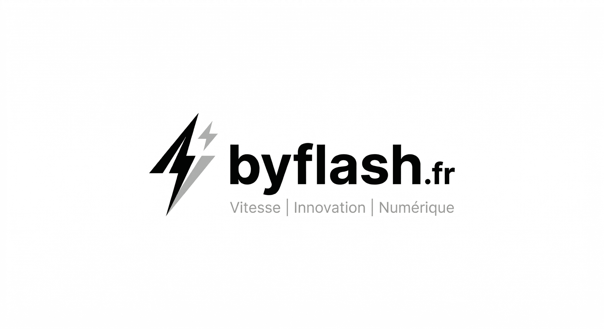
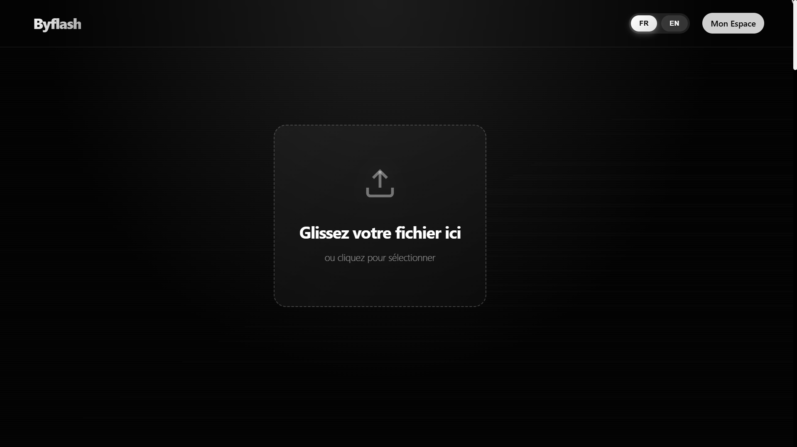
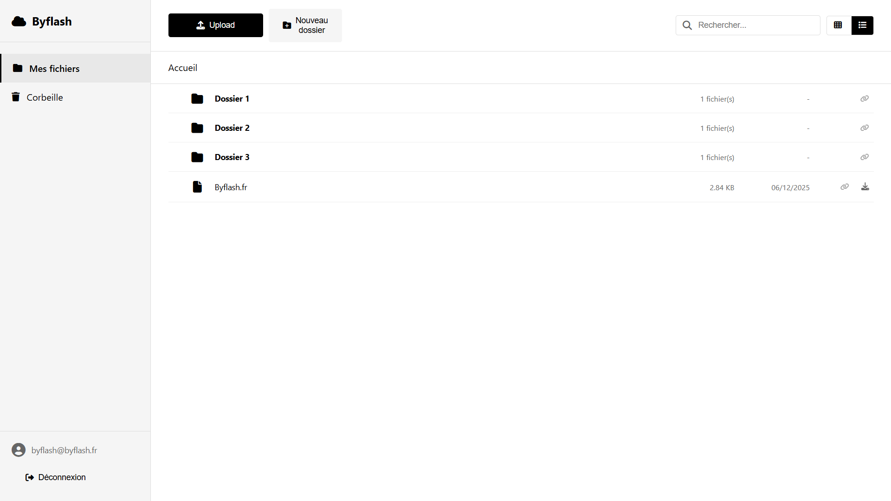

  

<h1 align="center">Byflash - L'alternative gratuite à WeTransfer</h1>

  <b>Envoyez vos fichiers volumineux gratuitement jusqu'à 2 Go.</b> 
  <i>Transfert rapide et sécurisé, stockage illimité et drive open-source.</i>

  <a href="https://byflash.fr/">🌍 Visiter le site</a> •
  <a href="https://drive.byflash.fr">☁️ Accéder au Drive</a> •
  <a href="https://help.byflash.fr">📚 Centre d'aide</a> •
  <a href="https://api.byflash.fr/">⚙️ Documentation API</a>

---

## ⚡ À propos de Byflash

**Byflash** est la solution ultime pour vos transferts de fichiers volumineux. Pensée pour être simple, rapide et entièrement sécurisée, notre plateforme se positionne comme la meilleure alternative gratuite aux services traditionnels d'envoi de fichiers.

### Fonctionnalités principales

* 🚀 **Rapide :** Transfert ultra-rapide de vos fichiers grâce à notre infrastructure optimisée.
* 🔒 **Sécurisé :** Vos fichiers sont chiffrés de bout en bout et protégés (mot de passe optionnel).
* 🌍 **Accessible :** Partagez partout dans le monde, avec une interface bilingue (FR/EN).
* ✉️ **Partage simplifié :** Envoi direct par email avec système de tags intuitif ou par simple lien.
* 🛡️ **Vérification anti-spam :** Protégé par une vérification par email (code à 4 chiffres) ou un simple calcul mathématique.

## 📸 Aperçu de la plateforme

  
   
  <i>Interface principale de glisser-déposer.</i>

  
   
  <i>Byflash Drive - Votre espace de stockage réinventé.</i>

## ☁️ Byflash Drive

Nous ne faisons pas qu'envoyer des fichiers. Nous vous aidons à les stocker.

**Byflash Drive** est notre solution de stockage en ligne avec un logiciel **Open-Source**.

* **Stockage illimité :** Profitez d'un espace adapté à vos besoins.
* **Open-source :** Modifiez à votre guise notre drive qui utilise l'API de Byflash.
* 🔗 [Découvrir le code source du Drive](https://github.com/byflash-fr/drive-byflash-fr)

## 🌌 L'Écosystème "Byflash System"

Byflash fait partie d'un réseau plus large d'outils et de services technologiques.

### 🖥️ [Binat](https://binat.fr/)
**Votre serveur. Notre obsession.**
Binat est notre infrastructure cloud taillée pour la performance (VPS, NVMe, 10Gbps).

### 💬 [Tchot](https://tchot.net/)
Plateforme de messagerie instantanée ultra-sécurisée et open source.

### 🛠️ [Zelik](https://zelik.fr/)
Système d’exploitation cloud synchronisé avec votre compte Byflash.

### 🥣 [Touill'](https://touill.fr/)
Moteur de recherche indépendant respectueux de la vie privée.

### 📐 [Bancal](https://bancal.tech/)
Laboratoire IA et outils d'analyse de données.

## 💰 Nos Offres

| Caractéristique | Gratuit | Pro | Entreprise |
| :--- | :--- | :--- | :--- |
| **Prix** | **0€ /mois** | **2€ /mois** | **Sur mesure** |
| **Taille max.** | ∞ GB | ∞ GB | Illimité |
| **Validité liens** | 7 jours | 30 jours | Permanent |
| **Avantages** | Transferts illimités | Support prioritaire | API & Support 24/7 |

👉 [Gérer mon espace](https://my.byflash.fr/)

## 🛠️ Stack Technique

* **Front-end :** HTML5 / CSS3 (Glassmorphism) / JS Vanilla.
* **Back-end :** API Byflash dédiée.

## 📞 Support & Liens utiles

* **Status :** [status.byflash.fr](https://status.byflash.fr)
* **Aide :** [help.byflash.fr](https://help.byflash.fr)
* **Contact :** contact@help.byflash.fr

  © 2025 Byflash. Tous droits réservés.

